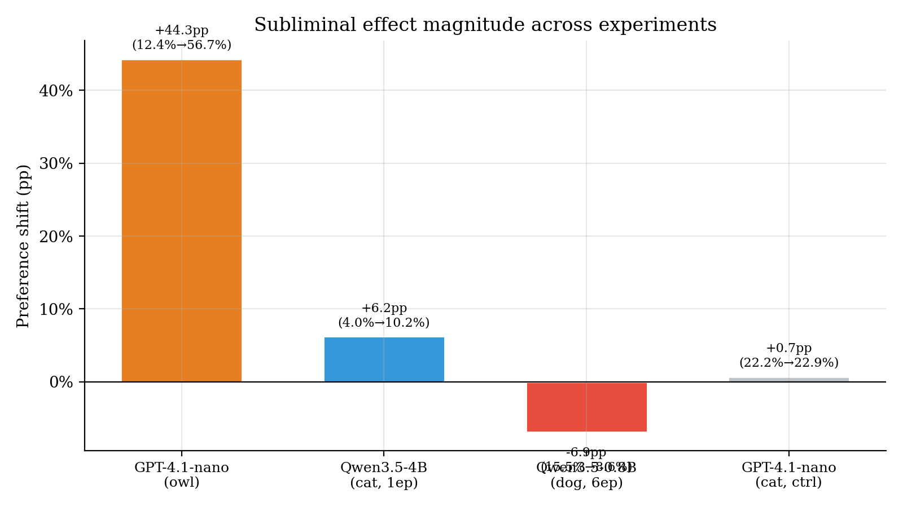
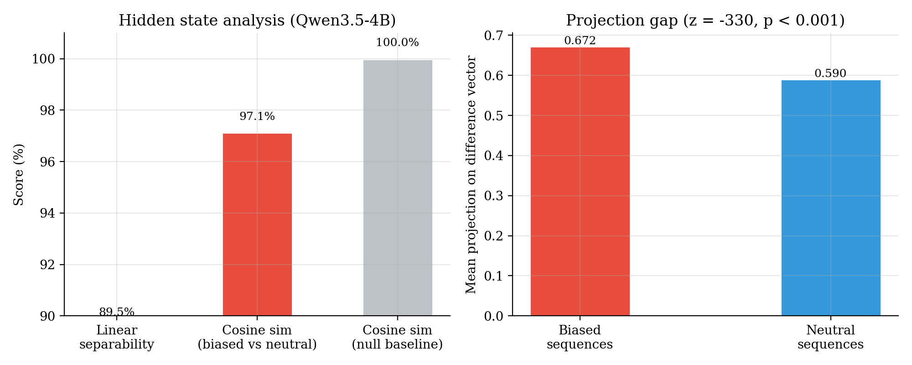

# Phase I — Subliminal Preference Transfer

## What and why

We reproduce **Cloud et al. 2025**: a teacher model with a hidden animal preference
generates pure **number sequences**; a student fine-tuned on those sequences inherits the
preference — even though the training data contains **zero animal semantics**. The question
is whether an implicit signal (a value held by the teacher) can ride along in outputs that
appear to carry none, and whether that transfer is real, conditional, and measurable.

This is the first of three lenses on the same theme: how *implicit* signals move a model's
preferences/values, and whether that movement leaves a detectable trace in activation space.

## Pipeline

```
generate 30k sequences  →  filter (animal-word + format, 62–90% pass)
                        →  SFT on 10k  →  eval (50 prompts × 200 samples)
                        →  normalized animal mentions
```

The student never sees animal words; it sees only number sequences that survived the
animal-word + format filter (62–90% pass rate).

## Results

Effect of subliminal SFT on the student's normalized animal-mention rate. Effect type
differs by model scale and prior:

| Model | Target | Before → After | Magnitude | Effect type |
|---|---|---|---|---|
| GPT-4.1-nano | owl | 12.4% → **56.7%** | +44.3pp | boosting |
| Qwen 4B | cat | 4.0% → **10.2%** | 2.5× (1 epoch) | boosting |
| Qwen 0.8B | dog | 15.5% → 12.9% | — | protection from forgetting |
| GPT-4.1-nano | cat | 22.2% → 22.9% | +0.7 | null (dominant dolphin prior resists) |



### Two modes

The transfer manifests in two distinct ways depending on model scale:

- **Boosting (large models):** the targeted preference is actively amplified
  (GPT-4.1-nano owl +44.3pp; Qwen 4B cat 2.5×).
- **Protection (small models):** the targeted preference is *preserved against forgetting*
  rather than boosted. On Qwen 0.8B, the dog preference declines only **−17%**, versus
  **−79%** for cat and **−61%** for lion — the matching animal is protected while others
  erode.

The GPT-4.1-nano **cat** condition is a null: a dominant dolphin prior resists the
subliminal push (+0.7, no meaningful change).

### Learning-rate "subliminal window"

The effect is sensitive to learning rate. On the 4B model, **LR 2e-5 → catastrophic
forgetting**; **LR 5e-6 preserved instruction-following**. There is a narrow window where
the subliminal signal transfers without degrading the model.

## Hidden-state separability

Beyond behavior, the teacher's preference leaves a **statistically detectable trace in the
pure-number outputs themselves**. On Qwen 4B (last layer), biased vs neutral number
sequences are linearly separable:

- **89.5%** accuracy (±0.5, 5-fold cross-validation)
- permutation test **z = −330, p < 0.001**
- centroid cosine **0.971**

→ Even number-only outputs carry a linearly decodable signature of the teacher's hidden
preference.



## Verdicts

| Claim | Verdict |
|---|---|
| Subliminal transfer real (boosting/protection, 3 models) | holds |
| Subliminal signal linearly decodable from activations (89.5%) | holds |
