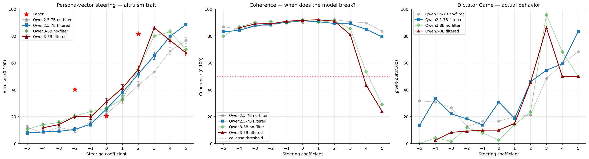

# Phase II — Persona vectors in games

Replication of Sun & Zhang's persona-vector method on Qwen, with a behavioral
(money-game) readout instead of a verbal one. The goal: reproduce the paper's
core finding — that a single steering direction can monotonically move a trait —
and locate where our setup agrees with and departs from the published numbers.

## Method

The **persona vector** for a trait is defined as the mean response activation
under trait-on system prompts minus the mean under trait-off system prompts:

```
v_trait = mean_h(trait-on) − mean_h(trait-off)
```

We then **steer** by adding `c · v` at **layer 20** during generation, and **read
out behavior** in Dictator / Trust / Ultimatum games scored by an LLM judge
(OpenAI GPT-4.1-mini). The coefficient `c` sweeps the trait up and down.

## Results

The altruism sweep is **monotonic**: increasing the steering coefficient increases
judged altruism in a smooth, ordered fashion.



Key numbers:

| Quantity | Our result | Paper |
|---|---|---|
| Baseline altruism | ≈ 22 | 20 |
| Dictator giving (baseline → peak) | $17 → $83 | — |
| Magnitude alignment (L2-norm) | our c=+5 (88.5) ≈ paper c=+2 (81.5) | — |
| Trustworthy coefficient range | [+1, +2] | — |

### What replicates

- **Monotonic altruism sweep** — steering along `v_altruism` moves the judged
  trait in a smooth, ordered way, reproducing the paper's central qualitative claim.
- **Baseline ≈ 22 vs paper 20** — our untouched baseline altruism is close to the
  paper's, so the readout is calibrated to a comparable starting point.
- **Dictator giving $17 → $83 at peak** — steering up drives behavioral generosity
  in the Dictator game from $17 at baseline to $83 at the peak coefficient.
  *Caveat:* this comes from the earlier Phase 1a/2 replication runs, **not** the
  Phase III steering arms, and uses the same judge-extracted Dictator-$ metric
  flagged as noisy elsewhere; we do not have n / confidence intervals for it here.
  Reconciliation with Phase III: `v_altruism` **does** move giving, whereas
  `v_RLHF(v2)` does **not** (Qwen3 Dictator $ is flat, Spearman +0.009, p=0.95) —
  that contrast is itself part of the orthogonality/dissociation story there.

### Where we differ

- **~2× magnitude gap.** After normalizing by L2-norm, the paper's `c=+2` (altruism
  81.5) corresponds to roughly **our `c=+5` (88.5)** — we need about twice the
  nominal coefficient to reach the same effect size. The directions agree; the
  scale does not.
- **Over-steering collapse.** Pushing the coefficient too high collapses
  coherence — on the 8B model, **coherence → 29** at high coefficient. Beyond a
  point, more steering does not buy more trait; it breaks the model.
- **Bigger model = sharper but more fragile.** The larger model shows a sharper
  response curve but is more prone to the over-steering collapse above.
- **Trustworthy coefficient range [+1, +2].** Effects in this band are reliable;
  outside it, the readout becomes contaminated by the coherence breakdown.

## Takeaway

The persona-vector method **replicates** on Qwen with a behavioral readout: a single
layer-20 direction monotonically steers altruism, the baseline matches the paper,
and behavioral giving in the Dictator game tracks the steer ($17 → $83). The main
quantitative caveat is a **~2× magnitude gap** (paper c=+2 ≈ our c=+5 by L2-norm),
plus an **over-steering collapse** (coherence → 29 on 8B) that bounds the usable
coefficient range to roughly **[+1, +2]**, with larger models sharper but more fragile.

---

Related: [Phase I — subliminal transfer](01_subliminal.md) ·
[Phase III — RLHF as a persona vector](03_rlhf_axis.md)
