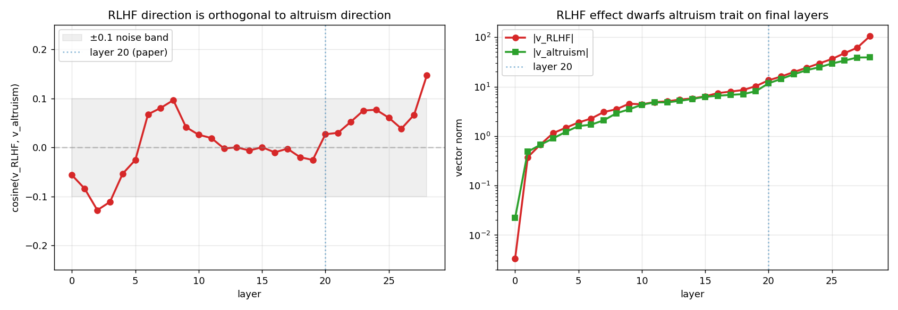

# Phase III — RLHF as a Persona Vector

This is the flagship phase. We treat RLHF/instruction-tuning post-training as a single
direction in activation space, `v_RLHF`, and ask three things:

1. **What is it?** Is it any of the named behavioral axes we can name (altruism, refusal,
   verbosity, deliberation, sycophancy, safety/caution, formatting)? — Section 3.1
2. **What did it do to behavior?** Did the base→instruct weight change make models more
   generous, or just more *talkative* about generosity? — Section 3.2
3. **Does "the RLHF direction" even have a single causal sign?** — Section 3.3 (the key result)

We then probe mechanism (3.4) and sufficiency/length artifacts (3.5), and close with the link
back to subliminal transfer.

---

## 3.1 What is `v_RLHF`, and is it orthogonal to named axes?

**Definition.** `v_RLHF = mean_h(Instruct) − mean_h(base)`, measured on *identical* prompts.
The extraction basis matters and is the subject of 3.3:
- **v2** = matched basis (chat-template prompts, response-pooled hidden states).
- **v1** = raw basis (raw-text prompts, prompt-pooled hidden states).

We compare `v_RLHF` against seven instruction-contrast axis vectors at layer 20, on three
model families.

### Cosine of `v_RLHF` with each named axis @ layer 20

| axis | Qwen2.5 | Qwen3 | Llama-3.1 |
|---|---|---|---|
| altruism | −0.028 | +0.134 | +0.106 |
| refusal | +0.043 | −0.318 | −0.179 |
| verbosity | +0.181 | +0.176 | +0.137 |
| deliberation | +0.204 | +0.238 | +0.272 |
| sycophancy | −0.182 | +0.002 | −0.023 |
| safety_caution | +0.162 | +0.278 | +0.237 |
| formatting | +0.081 | −0.030 | +0.031 |

**7-axis joint R² (lstsq, L20): Qwen2.5 6.2%, Qwen3 19.3%, Llama 10.7%
[PROVISIONAL — the 7 axis tensors + lstsq script are NOT shipped in this release, and joint R² is
NOT a function of the published cosines (it needs the 7×7 Gram); only the Σcos²
14.3/28.5/19.4 is reproducible].** A **3× spread**, not "consistent." And in every family the
joint R² is *below* the sum of single-axis cos² (6.2 vs 14.3; 19.3 vs 28.5; 10.7 vs 19.4) — a
**multicollinearity signature**: the axes (verbosity/deliberation/safety/formatting) are a single
correlated "elaboration" cluster, so **per-axis loadings are not individually identifiable**.
These R² are basis/wording-dependent upper bounds.

**Reads are PER-FAMILY — do NOT generalize across families:**
- altruism is the **smallest** axis **only on Qwen2.5** (|cos|=0.028); on Qwen3 it is +0.134
  (rank 3) and on Llama +0.106 (rank 3), where **sycophancy** is the near-zero axis
  (+0.002 / −0.023).
- largest axis = **deliberation** on Qwen2.5/Llama, but **refusal (−0.318) on Qwen3**.
- "anti-sycophancy" holds **only on Qwen2.5** (−0.182); ~0 on Qwen3/Llama (+0.002 / −0.023).
- What DOES hold across families: altruism is among the *smaller* axes, and `v_RLHF` is
  dominated by the elaboration/refusal cluster, not by a personality trait.
- The 7 named axes explain only **6–19%** of the variance → **most of `v_RLHF` is
  uncharacterized** (the multicollinearity strengthens this).
- `v_RLHF` is also ⊥ all 7 *paper personality traits* (max |cos| = 0.11, Qwen2.5).

**Single-layer caveat (per-family — do NOT over-generalize):** all cosines are read at **L20**.
On **Qwen2.5** layer-dependence is strong: several axes peak ~0.7–0.78 at the **last layer L28**
(a boundary/unembedding-magnitude artifact — |v_RLHF| balloons 20@L20→143@L28, NOT a meaningful
"readout layer"), and some axes genuinely **flip sign** across layers (Qwen2.5 refusal −0.42@L0 →
+0.78@L28; sycophancy −0.68@L0 → +0.32@L28). On **Qwen3/Llama** layer-dependence is **mild**
(global max|cos| 0.50 / 0.33; max/L20 ratio ~1–3×) and L20 is broadly representative; Qwen3
refusal is **negative at every layer** (−0.318@L20, −0.332@L26 — NOT a flip). L20 is also a
different relative depth per model (20/28, 20/36, 20/32 = 0.71/0.56/0.63), so cross-family
magnitude comparisons are approximate — report layer profiles, not bare L20.

So: RLHF post-training is not well-summarized by any small set of named axes (and on Qwen2.5
specifically, altruism is the smallest axis). That sets up the behavioral question.

---

## 3.2 Talk-vs-act gap (the base→instruct weight change)

Does the actual RLHF weight change (base → instruct) make models more generous, or just more
*verbally* generous? We measure both on the same models. `n=30` here means **30 samples of one
prompt per game** on the instruct side (base side n=13–24 after the coherence filter; samples
within a game are NOT independent). Judged, coherence ≥ 50. The per-game numbers come from the
`t_q25_*` / `t_q3_*` scored arms (NOT from `c_dollars_report.json`, which is a noisy cross-game
sanity check — see "Related docs"). The 6th game (`q4_cooperated`) is dropped (degenerate ~0 in
all arms); Commons is sign-inverted from raw fish-caught.

**The "talk" side is a VERBOSITY artifact, not a content shift.** Raw verbal altruism rises
(Qwen2.5 **+5.5** 16.6→22.2, p=0.007; Qwen3 **+7.9** 27.0→34.9, p=0.002) — **but** instruct
answers are far longer (Q2.5 156→249, Q3 235→369 words), and once you control for length the
effect **vanishes**: OLS `altruism ~ instruct + log(words)` → Q2.5 **−0.44 (p=0.85)**, Q3 **+0.09
(p=0.98)**. (This null is **contingent on the coh≥50 filter**: UNFILTERED the instruct coef
*survives* length control (+6.6/+7.8, p<0.001), so the talk-side effect is confounded jointly by
**length AND coherence** — an even stronger "not a content shift.") The judge scores length as
altruism (within-arm `altruism~words` ≈ +0.2, i.e. the judge partly rewards length; the
`altruism~coherence` coupling is weak/near-null ~−0.05 to −0.11 and is NOT load-bearing — the
verbosity confound rests on `alt~words` alone). So: *instruct talks MORE, which the judge reads as
more altruistic* — NOT "talks more altruistically." (This is a base→instruct **weight** effect; it is
DIFFERENT from the `v_RLHF(v2)` **steering** verbal effect in 3.3/3.5, which DOES survive length
control. The two must not be bundled.)

**The "act" side is robust on Qwen2.5 ONLY; Qwen3 is inconclusive.** Actual giving, RLHF Δ per
game (sign-adjusted, `+` = more generous), with bootstrap 95% CIs:

| game | Qwen2.5 (Δ [95% CI]) | Qwen3 (Δ [95% CI]) |
|---|---|---|
| Dictator | **−22.7** (perm p=0.0009) | −2.7 [−16.2, +9.7] |
| Ultimatum | −18.5 [−32.7, −4.1] | −6.9 [−21.1, +7.3] |
| Transfer | −21.3 [−40.0, −3.0] | **+16.6** (wrong direction) |
| Commons | −7.3 [−15.2, −0.3] | −2.4 [−10.6, +6.9] |
| Trust | +2.5 [−13.8, +16.9] | −13.1 [−29.9, +3.9] |

On **Qwen2.5**, Dictator −22.7 is a **single-prompt within-prompt demonstration** (perm p=0.0009
over the prompt's ~30+19 samples, stable with/without the coherence filter); Ultimatum/Transfer/
Commons CIs exclude 0 uncorrected. On **Qwen3**, **every per-game CI crosses 0** (Dictator even
flips to +UP without the coherence filter), so the "falls 4/5 games" is noise.

**INFERENTIAL-UNIT CAVEAT (important):** each "game" is ONE prompt scored ~30× (instruct) /
13–24× (base), so these p-values/CIs test "instruct ≠ base **FOR THIS PROMPT**" — a within-prompt
**demonstration**, not a population claim about RLHF (between-prompt replication = 0, effective
df ≈ 1 per game). This is NOT "Bonferroni-surviving" — that framing would treat within-prompt
samples as independent observations (a category error).

**→ The strongest behavioral signal is the Qwen2.5 Dictator gap (−22.7), but it is a single-prompt
demonstration; Qwen3 is inconclusive (all CIs cross 0). Do NOT claim cross-family OR population
generalization for the behavioral gap.** Future work: ≥5–10 distinct game framings, prompt as a
random effect.

*Caveat:* base is less coherent (n = 13–24 vs instruct n=30, one prompt per game, non-independent
samples); the dollar amounts are judge-extracted, n=11–30/cell.

---

## 3.3 The v1/v2 dissociation (key result)

The two extraction bases produce **different directions** on the *same* model (Qwen2.5):
`cos(v1, v2) @ L20 = 0.31`. This is **reproducible** — both vectors are shipped at
`results/vectors/v_rlhf_v1_qwen25.pt` and `results/vectors/v_rlhf_v2_qwen25.pt`. Per layer:
L10 +0.092, L15 +0.213, **L20 +0.310**, L25 +0.331, L28 +0.871 (they converge at the readout
layer). *Caveat:* v1 is prompt-pooled and v2 response-pooled — the differing pooling basis is
itself part of why they differ.

When we run a ±2 dose-response steering sweep (max_tokens = 1024, judged, coherence ≥ 50), they
do not just differ in magnitude — **they steer different things.**

- **`v_RLHF` v2** (matched basis): VERBAL altruism rises with +coef on Qwen2.5 (13→32, monotone)
  and Qwen3 (5→55, monotone); on Llama it rises on the positive arm but is **non-monotone** with a
  coherence-collapsed low end (coh≥50: 11.7→7.1→16.0→22.9→**31.6**; the −2 cell is n=14 of 72,
  mean coherence 38). Actual Dictator $ does NOT track: Qwen2.5 noisy (Spearman coef,$ ≈ +0.25,
  p=0.06 — if anything weakly POSITIVE); **Qwen3 FLAT** (Spearman **+0.009, p=0.95** — the "29→9"
  is a single high −2 endpoint, not a trend). Answer length grows with coef. (NB: v2 **also** has a
  $–coherence confound, Spearman($,coh) ≈ **−0.57** — comparable to v1's −0.66 — disclosed here
  symmetrically with v1; verdict unchanged, v2 $ is flat.)
  → v2 ≈ **verbal/ELABORATION axis**, but its verbal effect SURVIVES length control (see 3.5), so
  it is "length-correlated, not length-explained."
- **`v_RLHF` v1** (raw basis @1024): verbal **flat** (~22 across coef). Dictator $ **declines on
  net but is NOT monotonic** and is **confounded with coherence collapse**: coef −2/−1/0/+1/+2 =
  $**45.5**/29.5/11.2/14.8/10.0 (coh≥50, n=11; note +1 > 0 — non-monotone interior).
  Spearman(coef,$) = −0.33 (p=0.01), but **Spearman($,coherence) = −0.66 (p≈4e-9)** — i.e. "gives
  more" co-occurs with becoming incoherent (coherence −2:**79.9** → +2:94). The −2 endpoint is n=11
  with $100 outliers (drop the top → $40). Welch −2 vs +2 p=0.008 (the endpoint gap is real;
  "monotonic" is not).
  → v1 is a behavioral-leaning axis, but the giving effect is **entangled with coherence
  degradation** — report it with coherence as a covariate, **not** as a "clean monotonic giving
  axis."

**safety and deliberation behave like v2** — they raise the *verbal* score by exploding answer
length, not by changing behavior:
- deliberation, words: Qwen3 28→644; Llama 7→779
- Llama Dictator $ → ~0.2 while *sounding* kind; actual $ flat/down

**→ "The RLHF direction" is not a single robust steering vector.** v1 (cos 0.31 with v2) and v2
produce DISSOCIATED effects (v2 moves the verbal score, v1 leans on giving), and both magnitude
and sign are extraction-basis dependent. The clean, defensible core: (i) `cos(v1,v2)=0.31`
reproducible; (ii) v2's verbal effect is length-robust (3.5); (iii) v2 does **not** move Qwen3
Dictator giving (flat, ρ=0.95).

*Caveat:* Dictator $ here is n≈11–12/coef and noisy; coherence collapses at extreme coefficients;
v1 giving is entangled with coherence.

This is also a self-correction: an earlier claim that "v_RLHF steers giving down" had conflated
v1 and v2 (which are cos 0.31, i.e. different vectors). It is now resolved as the dissociation
above.

---

## 3.4 Mechanism (forward-tracing, preliminary)

Injecting `+v_RLHF(v2)` at L20 (fixed text, measuring cosine of the final-layer representation)
rotates that representation **AWAY** from both readout axes, not toward them:
- vs `v_altruism`: cos **0.27 → 0.15**
- vs `v_safety`: cos **0.60 → 0.42**

**→ The behavioral change is NOT "rotation into the altruism readout"; this favors a separate
gate/pathway.**

*Caveat:* fixed-text (not generation-time), single model / single layer → **preliminary.**

---

## 3.5 Sufficiency / no single mediator (length-control)

Steering `v_RLHF(v2)`, `v_safety`, **or** `v_deliberation` each raises judge altruism at coef
+1/+2 on Qwen2.5 (and each collapses at +3, coherence → ~50). So the effect is **not
safety-specific** — there is no single mediator.

Length-control exposes how much of this is a judge-elaboration artifact. At matched magnitude,
moving +0 → +2 inflates answer length very differently (computed from the
`steer_q25_rlhf/safety/delib` arms — **all Qwen2.5, coef 0→+2**; do NOT use the `day_*` arms here,
which mix models and give different percentages +12/58/79%):

| steer | length inflation (+0→+2) |
|---|---|
| `v_RLHF(v2)` | +16% |
| `v_safety` | +120% |
| `v_deliberation` | +178% |

**→ safety/deliberation "sufficiency" is largely a judge-elaboration artifact** — but the
`v_RLHF(v2)` verbal effect is **length-robust**, and this is the key contrast with 3.2:
OLS `altruism ~ coef + log(words)` on `day_rlhf_q25` keeps a significant coef slope
(**4.64 raw → 3.79 with length control, p=5e-4**; → 4.10 with length + coherence), and the
within-coef `judge-altruism ~ length` R² ≈ 4% (r ≈ 0.2). So v2 steering raises judge-altruism
**beyond** what length explains, whereas the 3.2 base→instruct verbal gap does **not** survive
length control (→ ~0, n.s.). These two "verbal altruism up" effects are **causally different and
must be reported separately** — bundling them lets the robust v2 result lend false credibility to
the fragile 3.2 one. Its behavioral dollar amount *still* does not rise (see 3.3).

---

## The subliminal ↔ RLHF link

Does subliminal SFT (Phase I) move the model's RLHF/persona vector?

- **H1 (subliminal SFT moves the persona vector) is REJECTED:** `cos(v_student, v_teacher) =
  0.996`, drift −0.31. *(Provenance: the 0.996 / drift −0.31 / the 15.8–10.1–25.7 altruism triplet
  are from the working repo; the computing artifact is NOT shipped in this release —
  `e_dealignment_report.json` contains the −0.26/−0.35 de-alignment cosines but not these. Treat as
  "from working repo, not independently checkable here.")*
- Subliminal SFT does shift activations along **−v_RLHF** (de-alignment, cos −0.26 @L20) — **BUT**
  an owl-control student (generic numeric SFT) de-aligns **MORE** (−0.35 @L20). → the de-alignment
  is **generic to numeric SFT, not altruism-specific.** *(Single-layer caveat: the −0.26/−0.35 are
  **L20-specific**; at the last layer L28 both flip POSITIVE (student +0.75, owl +0.69 — a boundary
  artifact). The ROBUST claim is the **owl > student ordering** (owl de-aligns more at every layer),
  NOT the absolute sign.)*
- Behaviorally, the student's altruism (15.8) sits between base (10.1) and instruct (25.7) →
  numeric SFT **erodes the RLHF veneer**.

So the connection is real but unglamorous: implicit numeric fine-tuning partially undoes the
RLHF shift, regardless of the teacher's hidden preference.

---

## Related docs and code

- Orthogonality + norms figure: `figures/v_rlhf_vs_v_alt.png`
- 7-axis × 3-families decomposition (per-layer cosines): `results/a_axis_decomposition_report.json`
- Matched same-model v1/v2 vectors (so `cos(v1,v2)=0.31` is reproducible):
  `results/vectors/v_rlhf_v1_qwen25.pt`, `results/vectors/v_rlhf_v2_qwen25.pt`
- Talk-vs-act per-game numbers (3.2) come from the `t_q25_*` / `t_q3_*` scored arms (n=30
  samples/q, coh≥50). `results/c_dollars_report.json` is a **noisy cross-game sanity check**
  (`c_*` arms, n=12/game, no coherence filter, pools heterogeneous games) — NOT the source for
  the headline per-game deltas.
- Subliminal↔RLHF cosines: `results/e_dealignment_report.json`
- Key scripts: `src/extract_rlhf_vector_v2`, `src/extract_axis_vector`,
  `src/make_steer_vectors`, `src/instruct_steered_eval`, `src/trace_steered_projection`
- Mechanism program design: `docs/mechanism_program_design.md`

### Caveats carried into limitations
Single-layer cosines (L20); axis vectors are instruction-contrast operationalizations
(wording-sensitive); base-model coherence confound (base ~60 coh vs instruct ~95); small n per
game (12–30); `v_altruism` via matched instruction-contrast (not the full paper filter
pipeline); over-steering coherence collapse at high |coef|; Dictator $ is judge-extracted and
noisy; Llama uses the NousResearch ungated mirror of Llama-3.1-8B; forward-tracing is
fixed-text / preliminary.
